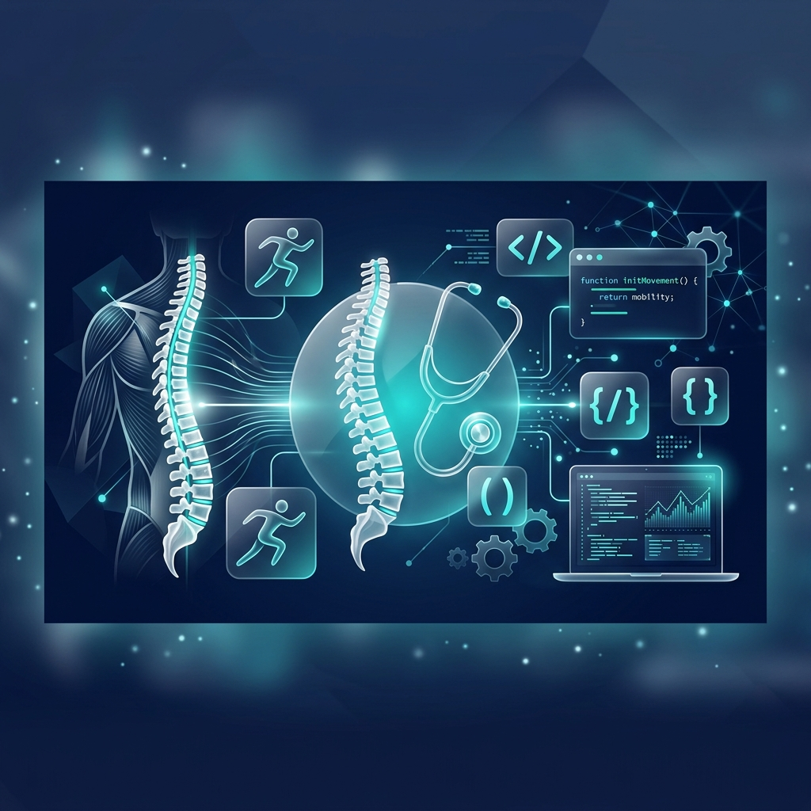

# Hi there!  I'm Ignacio Cuevas

  

  

## 🦴 About Me (Sobre mí)

- 🦴 **Physical Therapist** with over 10 years of clinical experience, specializing in **Orthopedic Manual Therapy**.
- 💻 Currently studying **Front-end Development** with a "Talento Digital" scholarship from the Chilean Government.
- 🚀 **Co-founder of Kiromov**, a kinesiology clinic in Chillán and Concepción, Chile.
- 🌱 **Learning**: Vue.js, HTML5, CSS3/SCSS, and JavaScript.
- 📍 Based in **Chillán, Chile** 🇨🇱

  

---

## 🛠️ Tech Stack

### Languages & Frameworks

### Tools & Platforms

---

## 📈 GitHub Stats

  

  
  

  

  

---

## 📬 Contact Me

---

  <i>Every challenge is an opportunity to learn and grow.</i> 
  <b>¡Gracias por visitar mi perfil!</b>

